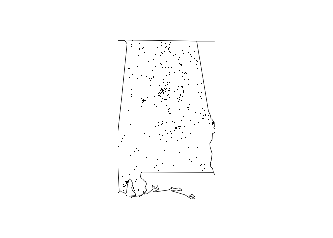

[](https://travis-ci.org/dappaduppa/ddweek4pkg)

<!-- README.md is generated from README.Rmd. Please edit that file -->
ddweek4pkg
==========

The goal of ddweek4pkg is to Fatality Analysis Reporting System...

Installation
------------

You can install ddweek4pkg from github with:

``` r
# install.packages("devtools")
devtools::install_github("dappaduppa/ddweek4pkg")
```

Example
-------

This is a basic example which shows you how to solve a common problem:

``` r
## basic example code
library(ddweek4pkg)
library(magrittr)

fars_map_state(1,"2013")
```



``` r

fars_summarize_years(c("2013", "2014"))
#> # A tibble: 12 x 3
#>    MONTH `2013` `2014`
#>    <int>  <int>  <int>
#>  1     1   2230   2168
#>  2     2   1952   1893
#>  3     3   2356   2245
#>  4     4   2300   2308
#>  5     5   2532   2596
#>  6     6   2692   2583
#>  7     7   2660   2696
#>  8     8   2899   2800
#>  9     9   2741   2618
#> 10    10   2768   2831
#> 11    11   2615   2714
#> 12    12   2457   2604
```
